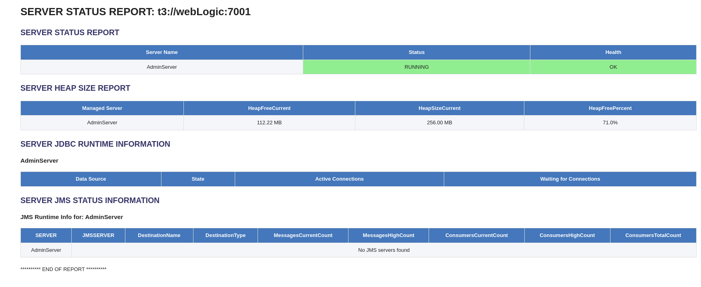

# WebLogic Server Monitoring System

## Overview
This monitoring system provides comprehensive monitoring capabilities for WebLogic Server environments, generating HTML reports with detailed information about server status, heap usage, JDBC connections, and JMS resources. The system automatically sends email notifications with color-coded alerts based on the server's health status.



## Features
- Server status monitoring (state and health)
- JVM heap usage analysis
- JDBC connection pool monitoring
- JMS queues and topics status
- Automated email notifications with status alerts

## Prerequisites
- Oracle WebLogic Server 12c or later
- Oracle Middleware Home configured
- Python with WLST support
- Linux/Unix environment
- Sendmail configured for email notifications

## Directory Structure
```
$MW_HOME/
├── Oracle_Home/
│   └── user_projects/
│       └── domains/
│           └── test_domain/
└── scripts/
    └── wlst/
        ├── monitor_all_servers.py
        └── monitor_weblogic.sh
```

## Configuration
1. Set the following environment variables in `monitor_weblogic.sh`:
   ```bash
   export MW_HOME=/home/username/Oracle/Middleware/Oracle_Home
   export DOMAIN_HOME=$MW_HOME/user_projects/domains/test_domain
   SCRIPT_PATH=/home/username/oracle/scripts/wlst
   SERVERS=webLogic
   PORT=7001
   EMAILS="your.email@example.com"
   ```

2. Update WebLogic credentials in `monitor_all_servers.py`:
   ```python
   connect('webLogic', 'your_password', 't3://%s:%s' % (sys.argv[1], sys.argv[2]))yassir
   ```

## Monitoring Components

### Server Status Monitoring
- Server state (RUNNING, STOPPED)
- Health status (OK, WARN, CRITICAL)
- Color-coded status indicators:
  - Green: Healthy/Running
  - Yellow: Warning
  - Red: Critical/Down

### Heap Usage Monitoring
- Current heap free space
- Total heap size
- Heap free percentage
- Warning thresholds:
  - Yellow: ≤ 20% free
  - Red: ≤ 10% free

### JDBC Monitoring
- Connection pool status
- Active connections count
- Waiting connections count
- Pool state monitoring

### JMS Monitoring
- JMS server status
- Queue/Topic metrics:
  - Current message count
  - High message count
  - Consumer statistics
  - Destination type

## Usage

### Running the Monitor
```bash
./monitor_weblogic.sh
```

### Alert Levels
- `[GREEN]`: All systems normal
- `[WARNING]`: Non-critical issues detected
- `[CRITICAL]`: Critical issues requiring immediate attention

## Email Notifications
The system sends HTML-formatted emails containing:
- Color-coded status indicators
- Complete server status report
- Resource utilization metrics
- JMS and JDBC statistics

## Security
Java Security Manager configuration:
```bash
export JAVA_OPTIONS="-Djava.security.manager -Djava.security.policy=$MW_HOME/wlserver/server/lib/weblogic.policy ${JAVA_OPTIONS}"
```

## Troubleshooting
1. If the script fails to connect:
   - Verify WebLogic server is running
   - Check credentials and port numbers
   - Ensure WLST path is correct

2. If emails are not received:
   - Verify sendmail configuration
   - Check email addresses in configuration
   - Verify file permissions
